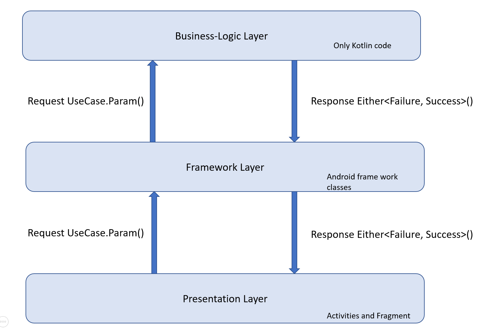

Intention of this file to provide a brief walk through regarding the
Code challenge and how it is implemented.

## Solution

> Architecture of this application is divided among three layers as mentioned

1. `BusinessLogic`
    - Code which could be independent of android framework.
    - This shall allow only kotlin or java libraries
    - It will allow separation of concern
    - Small test cases could be written which would be specific
2. `Framework`
    - Code related to android and its usage except UI
    - This can contain usage of Shared-Preference, SqLite, or Service components
    - This makes usage of `BusinessLogic` layer to complete its task when necessary
3. `Presentation`
    - This layer should only contain UI (Activities and Fragments)
    - There is trade of made to keep Dependency Injection and ViewModel
      classes within this layer (solely for purpose of reducing
      scrolling on Project pane to find classes needed in UI)
    - This shall make use of both `BusinessLogic` and `Framework`,
      That's a problem, needed to improve by removing this layers dependency on
      `BusinessLogic`

----

### Assumptions

   - API shall always return valid data ()
   - Due to small scope didn't not implement progressbar to notify user regarding network call.
   - In case of tablet, requirement is tweaked a little to show only one screen.
     To avoid a lot of empty space.

### Software Used

   - Android Studio             - 3.5.3
   - Kotlin                     - 1.3.61
   - Gradle Wrapper             - 5.6.1
   - Gradle Plugin for android  - 3.5.1

### Third party Libraries
   - Retrofit is used along with interceptor-logger, as it provides state of the art
     logs in Logcat itself. Android-Studio Profiler can give more information, but
     you would have to keep it on. There are times when uninteresting network call needs attention
     after it was made!

### Data flow

